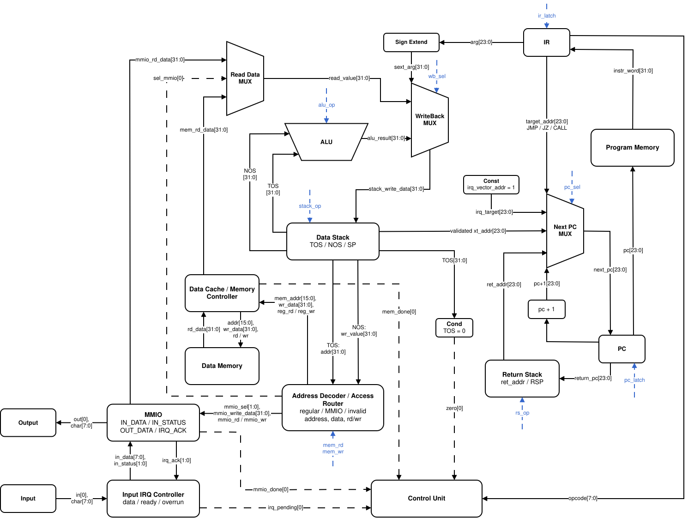
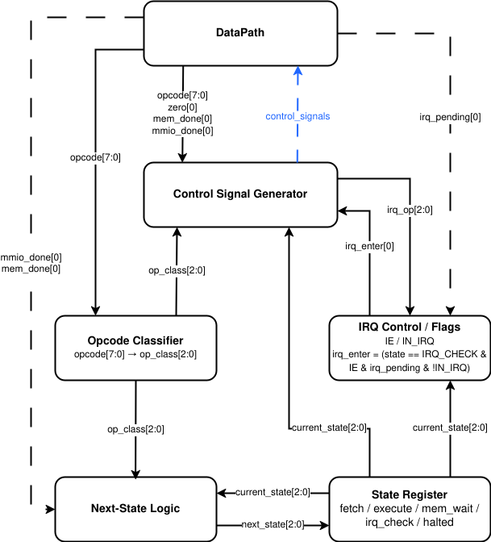

# Лабораторная работа №4. Транслятор и модель процессора

- ФИО: `Бармичев Григорий Андреевич`
- Группа: `P3210`
- Вариант: `forth | stack | harv | hw | tick | binary | trap | mem | pstr | prob1 | cache`
- Язык реализации: Python

## Содержание

- [Язык программирования](#язык-программирования)
- [Организация памяти](#организация-памяти)
- [Система команд](#система-команд)
- [Транслятор](#транслятор)
- [Модель процессора](#модель-процессора)
- [Ввод-вывод MMIO и прерывания](#ввод-вывод-mmio-и-прерывания)
- [Кэш](#кэш)
- [Тестирование](#тестирование)
- [Примеры работы](#примеры-работы)
- [Статистика](#статистика)

## Язык программирования

Реализован минимальный диалект Forth. Программа состоит из потока слов. Все вычисления выполняются через стек данных. Поддержаны процедуры, переменные, буферы, условные переходы, циклы `begin/until`, строки с префиксом длины, обработчик прерывания и `execution token`.

### Синтаксис

Синтаксис описан в расширенной форме Бэкуса-Наура.

```ebnf
program        = { top-item } ;

top-item       = definition
               | irq-definition
               | declaration
               | word ;

definition     = ":" , name , { word } , ";" ;
irq-definition = ":irq" , { word } , ";" ;

declaration    = "variable" , name
               | "buffer" , name , integer ;

word           = integer
               | name
               | "'" , name
               | "execute"
               | "if" | "else" | "then"
               | "begin" | "until"
               | "dup" | "drop" | "swap" | "over"
               | "+" | "-" | "*" | "/" | "mod"
               | "=" | "<" | ">"
               | "@" | "!"
               | "ei" | "di" | "iret" | "halt"
               | pstring
               | print-string ;

pstring        = "p\"" , { string-char } , "\"" ;
print-string   = ".\"" , { string-char } , "\"" ;
name           = letter , { letter | digit | "-" | "_" | "?" | "!" } ;
integer        = [ "-" ] , digit , { digit } ;
comment        = "\\" , { any-char-except-newline } , newline ;
```

### Семантика

#### Стратегия вычислений

Вычисления строгие и последовательные. Слова выполняются слева направо. Операнды передаются через стек данных: числовой литерал кладёт значение на стек, арифметическая операция снимает аргументы со стека и кладёт результат обратно.

#### Области видимости

Все имена глобальные. Процедуры, переменные и буферы находятся в одной области имён. Повторное объявление имени запрещено. Локальные переменные не поддерживаются.

#### Типизация

Типизация отсутствует. Все значения представлены 32-битными машинными словами. Одно и то же слово может интерпретироваться как число, адрес, символ или флаг. Для логических значений используется соглашение: `0` -- ложь, `1` -- истина.

#### Строки `pstr`

Строки хранятся в памяти данных в формате Pascal string: первая ячейка содержит длину строки, следующие ячейки -- коды символов. Один символ занимает одну 32-битную ячейку.

```text
p"Hi"

addr + 0 : 2
addr + 1 : 72   ('H')
addr + 2 : 105  ('i')
```

Слово `p"..."` размещает строку в памяти данных и кладёт её адрес на стек. Для вывода строки используется библиотечная процедура `type`. Слово `."..."` является синтаксическим сокращением: оно размещает Pascal-строку в памяти данных и сразу генерирует вызов `type`.

#### Комментарии

Комментарий начинается с символа `\` и продолжается до конца строки.

## Организация памяти

Архитектура гарвардская: память команд и память данных разделены. Обе памяти адресуются по 32-битным словам. В бинарном файле одно слово хранится как 4 байта, но внутри модели адрес -- это номер слова, а не байтовый адрес.

### Память команд

```text
Program memory
+------------------------------+
| 0000 : jmp main              |
| 0001 : jmp irq_handler       |
| .... : stdlib procedures     |
| .... : user procedures       |
| .... : main                  |
+------------------------------+
```

Адрес `0` используется как reset vector. Адрес `1` используется как interrupt vector. Далее размещаются процедуры стандартной библиотеки, пользовательские процедуры и основной код программы.

### Память данных

```text
Data memory
+------------------------------+
| 0000 : stdlib variables      |
| .... : input buffer          |
| .... : user variables        |
| .... : user buffers          |
| .... : static pstrings       |
| FFF0 : MMIO_IN_DATA          |
| FFF1 : MMIO_IN_STATUS        |
| FFF2 : MMIO_OUT_DATA         |
| FFF3 : MMIO_IRQ_ACK          |
+------------------------------+
```

Строковые литералы, переменные и буферы размещаются статически на этапе трансляции. Обычные адреса памяти данных проходят через кэш. MMIO-адреса распознаются декодером адреса и направляются напрямую в регистры устройств.

### Стеки

Процессор использует два стека.

- `Data Stack` -- основной стек операндов. Через него выполняются арифметика, сравнения, работа с адресами и памятью.
- `Return Stack` -- стек адресов возврата. Он используется командами `call`, `ret`, `execute`, входом в прерывание и `iret`. 

Архитектурно верхушка стека обозначается как `TOS` (`top of stack`), подверхушка -- как `NOS` (`next on stack`). ALU получает операнды из `TOS/NOS`, а результат возвращается на `Data Stack`. В Python-модели стек хранится списком, а `TOS/NOS` выводятся в журнале как derived view.

## Система команд

### Особенности ISA

- **Архитектура:** стековая.
- **Машинное слово:** одна инструкция и одна ячейка данных занимают 32 бита.
- **Адресация:** адрес указывает на 32-битное слово.
- **Доступ к памяти:** память данных доступна через `load` и `store`.
- **Поток управления:** переходы выполняются инструкциями `jmp`, `jz`, `call`, `ret`, `execute`, `iret`.
- **Ввод-вывод:** memory-mapped, специальных инструкций `in/out` нет. Устройства доступны обычными `load/store` по MMIO-адресам.

### Кодирование инструкций

Каждая инструкция занимает одно 32-битное слово.

```text
31          24 23                          0
+-------------+----------------------------+
| opcode: 8   | arg: 24                    |
+-------------+----------------------------+
```

В бинарных файлах `program.bin` и `data.bin` каждое машинное слово записывается как 4 байта в порядке **big-endian**. Внутри модели адресация остаётся пословной: адрес указывает на номер 32-битного слова. В `.hex`-листингах то же слово отображается как 8 шестнадцатеричных цифр.

### Набор инструкций

| Opcode | Мнемоника | Аргумент     | Эффект стека        | Описание                           |
| -----: | --------- | ------------ | ------------------- | ---------------------------------- |
| `0x00` | `nop`     | нет          | `--`                | пустая операция                    |
| `0x01` | `lit`     | signed imm24 | `( -- x )`          | положить литерал                   |
| `0x02` | `dup`     | нет          | `( x -- x x )`      | дублировать вершину                |
| `0x03` | `drop`    | нет          | `( x -- )`          | удалить вершину                    |
| `0x04` | `swap`    | нет          | `( a b -- b a )`    | обменять два верхних значения      |
| `0x05` | `over`    | нет          | `( a b -- a b a )`  | скопировать второе значение сверху |
| `0x10` | `add`     | нет          | `( a b -- a+b )`    | сложение                           |
| `0x11` | `sub`     | нет          | `( a b -- a-b )`    | вычитание                          |
| `0x12` | `mul`     | нет          | `( a b -- a*b )`    | умножение                          |
| `0x13` | `div`     | нет          | `( a b -- a/b )`    | целочисленное деление              |
| `0x14` | `mod`     | нет          | `( a b -- a%b )`    | остаток от деления                 |
| `0x20` | `eq`      | нет          | `( a b -- flag )`   | равно                              |
| `0x21` | `lt`      | нет          | `( a b -- flag )`   | меньше                             |
| `0x22` | `gt`      | нет          | `( a b -- flag )`   | больше                             |
| `0x30` | `load`    | нет          | `( addr -- value )` | чтение памяти данных или MMIO      |
| `0x31` | `store`   | нет          | `( value addr -- )` | запись в память данных или MMIO    |
| `0x40` | `jmp`     | addr24       | `--`                | безусловный переход                |
| `0x41` | `jz`      | addr24       | `( flag -- )`       | переход, если `flag = 0`           |
| `0x42` | `call`    | addr24       | `--`                | вызов процедуры                    |
| `0x43` | `ret`     | нет          | `--`                | возврат из процедуры               |
| `0x44` | `execute` | нет          | `( xt -- )`         | косвенный вызов процедуры          |
| `0x50` | `ei`      | нет          | `--`                | разрешить прерывания               |
| `0x51` | `di`      | нет          | `--`                | запретить прерывания               |
| `0x52` | `iret`    | нет          | `--`                | возврат из обработчика IRQ         |
| `0xFF` | `halt`    | нет          | `--`                | останов процессора                 |

### Длительности выполнения инструкций

Один `tick` соответствует одному состоянию конечного автомата ControlUnit. Обычная инструкция выполняется за 4 такта:

```text
FETCH -> DECODE -> EXECUTE -> IRQ_CHECK
```

| Стадия | Тактов | Действие |
|---|---:|---|
| `FETCH` | 1 | чтение `program_memory[PC]` в `IR`, увеличение `PC` |
| `DECODE` | 1 | декодирование opcode и аргумента |
| `EXECUTE` | 1 | выполнение инструкции |
| `IRQ_CHECK` | 1 | проверка входного прерывания |

`halt` занимает 3 такта, так как останавливает машину на стадии `EXECUTE`. `load` и `store` при cache hit выполняются за обычные 4 такта, а при cache miss или выключенном кэше занимают 13 тактов.

### Стандартная библиотека

Файл `src/stdlib.fth` автоматически подключается транслятором перед пользовательской программой и компилируется как обычный код.

| Слово          | Назначение                                      |
| -------------- | ----------------------------------------------- |
| `emit`         | вывести один символ через `MMIO_OUT_DATA`       |
| `cr`, `space`  | вывести перевод строки или пробел               |
| `read-char`    | прочитать символ из `MMIO_IN_DATA`              |
| `ack-irq`      | подтвердить обработку входного прерывания       |
| `input-init`   | инициализировать программный буфер ввода        |
| `input-push`   | положить символ в буфер ввода                   |
| `input-ready?` | проверить наличие символа в буфере              |
| `input-pop`    | извлечь символ из буфера                        |
| `wait-char`    | дождаться символа в программном буфере          |
| `digit?`       | проверить, является ли символ десятичной цифрой |
| `read-number`  | прочитать знаковое десятичное число             |
| `print-int`    | напечатать знаковое число                       |
| `type`         | вывести Pascal-строку                           |

## Транслятор

Интерфейс командной строки:

```bash
python src/translator.py <source.fth> <program.bin> <data.bin>
```

В результате создаются:

```text
program.bin      бинарная память команд
data.bin         бинарная память данных
program.bin.hex  человекочитаемый листинг команд
data.bin.hex     человекочитаемый листинг данных
```

Этапы трансляции:

1. Подключение `src/stdlib.fth` перед пользовательским кодом.
2. Лексический разбор исходного текста.
3. Обработка объявлений `variable`, `buffer`, процедур `: ... ;`, обработчика `:irq ... ;` и основного кода.
4. Размещение переменных, буферов и строковых литералов в памяти данных.
5. Генерация инструкций и фиксация неразрешённых адресов.
6. Разрешение адресов процедур, переходов и `execution token` через `fixups`.
7. Запись бинарных файлов `program.bin`, `data.bin` и текстовых листингов `program.bin.hex`, `data.bin.hex`.

Правила генерации кода:

- числовой литерал компилируется в `lit value`;
- встроенные арифметические слова компилируются в соответствующие ALU-инструкции;
- имя переменной или буфера компилируется как `lit address`;
- `@` компилируется в `load`, `!` -- в `store`;
- вызов пользовательского слова компилируется в `call address`;
- определение `: name ... ;` размещает тело процедуры в памяти команд и завершает его `ret`;
- `' name` компилируется как `lit address(name)`;
- для встроенных примитивов, которые обычно не имеют собственного адреса в памяти команд, транслятор создаёт скрытое trampoline-слово вида `primitive; ret`, поэтому их тоже можно использовать как `execution token`;
- `execute` выполняет косвенный вызов по адресу с вершины стека;
- `if/else/then` компилируются через `jz` и `jmp`;
- `begin/until` компилируется как метка начала цикла и условный переход назад;
- `p"..."` размещает Pascal-строку в памяти данных и кладёт её адрес на стек;
- `."..."` размещает Pascal-строку и сразу генерирует вызов `type`;
- `type` печатает Pascal-строку, адрес которой лежит на вершине стека;
- если программа не определяет `:irq`, транслятор создаёт безопасный обработчик по умолчанию: он записывает `1` в `MMIO_IRQ_ACK` и выполняет `iret`, чтобы сбросить внешний запрос прерывания.

## Модель процессора

Интерфейс командной строки:

```bash
python src/machine.py <program.bin> <data.bin> [input.txt] [--limit <ticks>] [--log <log.txt>] [--output <output.txt>] [--cache | --no-cache] [--cache-lines <n>]
```

Опции:

- `--limit <ticks>` -- задаёт ограничение моделирования;
- `--log <log.txt>` -- сохраняет журнал;
- `--output <output.txt>` -- сохраняет вывод программы;
- `--cache/--no-cache` -- включает или выключает кэш данных;
- `--cache-lines <n>` -- задаёт число строк кэша.

Модель исполняет бинарную память команд и бинарную память данных. Выполнение идёт с точностью до такта.

### Формат журнала

На каждом такте в журнал добавляется строка с номером такта, `PC`, состоянием ControlUnit, режимом `user/irq`, верхними значениями стеков, флагами прерываний, статистикой кэша, текущей инструкцией и событием такта.

```text
DEBUG   machine:simulation    TICK: ... PC: ... STATE: ... MODE: ... TOS: ... NOS: ... DS_DEPTH: ... RS_DEPTH: ... DS: ... RS: ... IE:... IP:... CACHE:...    instr [event]
```

Поле `STATE` показывает состояние FSM, которое выполнялось на данном такте. Остальные поля строки (`PC`, `MODE`, `IE`, стеки, кэш и т.д.) показывают состояние процессора после выполнения события этого такта.

### DataPath



Глобальные линии `clk/reset` на схеме DataPath не показаны, чтобы не перегружать рисунок; обновление регистров задаётся управляющими сигналами `pc_latch`, `ir_latch`, `stack_op`, `rs_op`, `mem_rd/mem_wr` и другими.

Основные блоки DataPath:

- `Program Memory` -- память инструкций;
- `PC` -- счётчик команд;
- `IR` -- регистр текущей инструкции;
- `Data Stack` -- стек операндов;
- `Return Stack` -- стек адресов возврата;
- `ALU` -- арифметика и сравнения;
- `Data Cache` -- кэш обычной памяти данных;
- `Data Memory` -- память данных;
- `Address Decoder` -- выбор между обычной памятью и MMIO;
- `MMIO` -- memory-mapped регистры ввода-вывода;
- `Input IRQ Controller` -- внешнее устройство ввода: получает события из `input schedule`, выставляет `input_char`, `input_status`, `irq_pending` и фиксирует `overrun`;
- `Next PC MUX` -- выбирает следующий адрес команды: `pc + 1`, `target_addr` из `IR`, `ret_addr` из `Return Stack`, `xt_addr` из `Data Stack` или `irq_vector_addr`;
- `WriteBack MUX` -- выбирает источник значения, записываемого обратно в `Data Stack`: результат ALU, `lit`-значение или значение из памяти/MMIO;
- `Read Data MUX` -- выбирает источник результата чтения: `Data Cache` или `MMIO`;

Обычные адреса памяти данных проходят через `Data Cache`. MMIO-адреса распознаются `Address Decoder` и обходят кэш. Подтверждение входного прерывания выполняется не сигналом процессора, а записью обработчика в регистр `MMIO_IRQ_ACK`; эта запись приходит из `MMIO` в `Input IRQ Controller` как `irq_ack write`.

### ControlUnit



Control Unit реализован как hardwired FSM, вместе с минимальным внешним контекстом DataPath. Пунктирная рамка отделяет внутреннюю логику ControlUnit от внешних фрагментов DataPath.

Основные блоки ControlUnit:

- `Decode / dispatch` получает `opcode, arg` из `IR` и формирует класс операции `op_class`;
- `Sequencer / next-state` является комбинационной логикой переходов FSM и по `current_state`, `op_class` и `cache_status` выбирает следующий state;
- `State Register` хранит текущее состояние FSM: `FETCH`, `DECODE`, `EXECUTE`, `MEM_WAIT`, `IRQ_CHECK`, `HALTED`;
- `Datapath control` по `current_state`, `op_class`, `zero?`, `cache_status` и `irq_enter` формирует управляющие сигналы для DataPath;
- `IRQ control` хранит внутренние флаги `IE` и `IN_IRQ`, получает `irq_pending` от `Input IRQ Controller`, учитывает `op_class` и `current_state`, обновляет флаги на `ei`, `di`, `iret` и формирует внутренний сигнал `irq_enter`.

Сигналы `tick/clk` и `reset` являются внешними входами FSM. `tick/clk` фиксирует переход `State Register` из `current_state` в `next_state`. `reset` переводит автомат в начальное состояние `FETCH`; также при сбросе инициализируются начальные значения процессора, включая `PC <- 0`, `IE <- 0`, `IN_IRQ <- 0`.

## Ввод-вывод MMIO и прерывания

Ввод-вывод реализован как memory-mapped I/O. Специальных инструкций `in/out` нет, устройства доступны обычными `load` и `store`. Вход работает через `trap`: входной файл содержит пары `tick symbol`, например `10 Z`. Когда счётчик тактов достигает указанного значения, символ становится доступен в `MMIO_IN_DATA`, `MMIO_IN_STATUS` становится равен `1`, а `irq_pending` устанавливается в `true`.

| Адрес | Имя | Доступ | Назначение |
|---:|---|---|---|
| `0xFFF0` | `MMIO_IN_DATA` | read | входной символ |
| `0xFFF1` | `MMIO_IN_STATUS` | read | флаг готовности входного символа |
| `0xFFF2` | `MMIO_OUT_DATA` | write | вывести символ |
| `0xFFF3` | `MMIO_IRQ_ACK` | write | подтвердить обработку IRQ |

Программа разрешает прерывания инструкцией `ei`. На стадии `IRQ_CHECK` процессор проверяет `irq_enable`, `irq_pending` и `in_irq`. При входе в обработчик текущий `PC` сохраняется в `Return Stack`, `PC` устанавливается в `IRQ_VECTOR`, `irq_enable` сбрасывается. Пользовательский обработчик `:irq` читает символ через `read-char`, подтверждает обработку через `ack-irq` и возвращается инструкцией `iret`.

## Кэш

Реализован кэш данных. Кэш прямого отображения: каждая ячейка памяти может находиться только в одной строке кэша.

```text
index = address % line_count
tag   = address // line_count
```

`index` выбирает единственную строку кэша, где может лежать значение. Если строка валидна и `tag` совпадает, происходит cache hit. Если `tag` не совпадает или строка невалидна, происходит cache miss. 

При промахе выбранная строка перезаписывается новым `tag` и новым значением. Это конфликтное вытеснение прямо отображаемого кэша. Для записи используется write-through: значение записывается и в кэш, и в основную память. MMIO-адреса не кэшируются.

Сравнение на `examples/cache_demo.fth`:

```text
cache on : ticks=2299 instructions=530 hits=122 misses=20
cache off: ticks=3397 instructions=530 uncached_reads=91 uncached_writes=51
```

Количество исполненных инструкций одинаковое, но при включённом кэше требуется меньше тактов. Ниже приведено сравнение запусков всех примеров с включённым и выключенным кэшем.

| Алгоритм          | ticks cache on | ticks cache off | hits/misses | uncached R/W | Ускорение по тактам |
| ----------------- | -------------: | --------------: | ----------: | -----------: | ------------------: |
| `arithmetic`      |           1221 |            1698 |       53/14 |        47/20 |               1.39x |
| `cache_demo`      |           2299 |            3397 |      122/20 |        91/51 |               1.48x |
| `cat`             |           6355 |            6518 |      273/20 |       186/33 |               1.03x |
| `hello`           |           1780 |            2509 |       81/21 |        72/30 |               1.41x |
| `hello_user_name` |          17314 |           18239 |      771/87 |      539/125 |               1.05x |
| `irq_echo`        |            892 |            1252 |        40/1 |        20/21 |               1.40x |
| `prob1`           |         113358 |          171892 |    6862/439 |    5693/1504 |               1.52x |
| `sort`            |          24746 |           27732 |    1124/175 |      779/290 |               1.12x |
| `wide`            |           1882 |            2602 |       80/31 |        69/42 |               1.38x |
| `xt_demo`         |            902 |            1217 |       35/11 |        32/14 |               1.35x |

## Тестирование

Интеграционные тесты реализованы через `pytest-golden`.

```bash
pytest tests/test_golden.py
pytest --update-goldens tests/test_golden.py
```

Каждый golden-файл содержит:

- `in_source` -- исходную программу;
- `in_stdin` -- расписание входных событий;
- `out_code` -- листинг памяти команд;
- `out_data` -- листинг памяти данных;
- `out_stdout` -- вывод инструментальной цепочки;
- `out_log` -- адаптированный журнал работы процессора.

Журнал в golden tests сокращается до начала и конца выполнения, чтобы не хранить сотни строк лога.

Проверка качества кода:

```bash
ruff format --check .
ruff check .
mypy src tests
pytest tests/test_golden.py
```

CI выполняет те же проверки в GitHub Actions.

### Golden tests

| Тест              | Назначение                                   | Ссылка                             |
| ----------------- | -------------------------------------------- | ---------------------------------- |
| `hello`           | печать Hello world через `pstr` и `type`     | `tests/golden/hello.yml`           |
| `cat`             | печать входных символов через trap-ввод      | `tests/golden/cat.yml`             |
| `hello_user_name` | ввод имени и приветствие                     | `tests/golden/hello_user_name.yml` |
| `sort`            | length-prefixed сортировка знаковых чисел    | `tests/golden/sort.yml`            |
| `wide`            | 64-битное сложение через 4 limb по 16 бит    | `tests/golden/wide.yml`            |
| `prob1`           | Project Euler Problem 4                      | `tests/golden/prob1.yml`           |
| `cache_demo`      | демонстрация кэша                            | `tests/golden/cache_demo.yml`      |
| `irq_echo`        | демонстрация trap-прерывания                 | `tests/golden/irq_echo.yml`        |
| `xt_demo`         | демонстрация execution token                 | `tests/golden/xt_demo.yml`         |
| `arithmetic`      | базовая арифметика                           | `tests/golden/arithmetic.yml`      |

## Примеры работы

### Hello world

Исходная программа `examples/hello.fth`:

```forth
."Hello, world!\n"
halt
```

На этапе трансляции строка размещается в памяти данных как Pascal string:

```text
00000056 - 0000000E - 14
00000057 - 00000048 - 72   'H'
00000058 - 00000065 - 101  'e'
...
00000064 - 0000000A - 10   '\n'
```

В памяти команд вывод строки представлен как загрузка адреса строки и вызов `type`:

```text
000000FF - 01000056 - lit 86
00000100 - 420000DD - call 221
00000101 - FF000000 - halt
```

Запуск:

```bash
python src/translator.py examples/hello.fth program.bin data.bin
python src/machine.py program.bin data.bin --log hello.log
```

Вывод:

```text
Hello, world!
summary: ticks=1780 instructions=398 cache=on hits=81 misses=21 uncached_reads=0 uncached_writes=0 input_overruns=0
```

Фрагмент журнала:

```text
DEBUG   machine:simulation    TICK:     0 PC:     1 STATE: fetch     MODE: user TOS:       - NOS:       - DS_DEPTH:  0 RS_DEPTH:  0 DS: []               RS: []               IE:0 IP:0 CACHE:0/0	jmp 255 [fetch @00000000]

DEBUG   machine:simulation    TICK:     1 PC:     1 STATE: decode    MODE: user TOS:       - NOS:       - DS_DEPTH:  0 RS_DEPTH:  0 DS: []               RS: []               IE:0 IP:0 CACHE:0/0	jmp 255 [decode jmp 255]

DEBUG   machine:simulation    TICK:     2 PC:   255 STATE: execute   MODE: user TOS:       - NOS:       - DS_DEPTH:  0 RS_DEPTH:  0 DS: []               RS: []               IE:0 IP:0 CACHE:0/0	jmp 255 [jmp 0x000000FF]
```

## Статистика

Статистика получена запуском программ из `examples` после подключения `src/stdlib.fth`.

| Алгоритм | LoC | code instr | code bytes | data cells | exec instr | ticks |
|---|---:|---:|---:|---:|---:|---:|
| `arithmetic` | 10 | 275 | 1100 | 108 | 274 | 1221 |
| `cache_demo` | 21 | 292 | 1168 | 96 | 530 | 2299 |
| `cat` | 15 | 273 | 1092 | 86 | 1544 | 6355 |
| `hello` | 4 | 262 | 1048 | 101 | 398 | 1780 |
| `hello_user_name` | 33 | 307 | 1228 | 151 | 4133 | 17314 |
| `irq_echo` | 17 | 274 | 1096 | 87 | 221 | 892 |
| `prob1` | 91 | 424 | 1696 | 103 | 27352 | 113358 |
| `sort` | 68 | 403 | 1612 | 122 | 5793 | 24746 |
| `wide` | 65 | 367 | 1468 | 120 | 401 | 1882 |
| `xt_demo` | 16 | 283 | 1132 | 102 | 201 | 902 |
