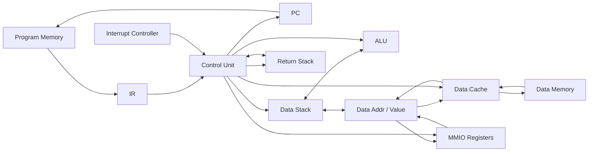
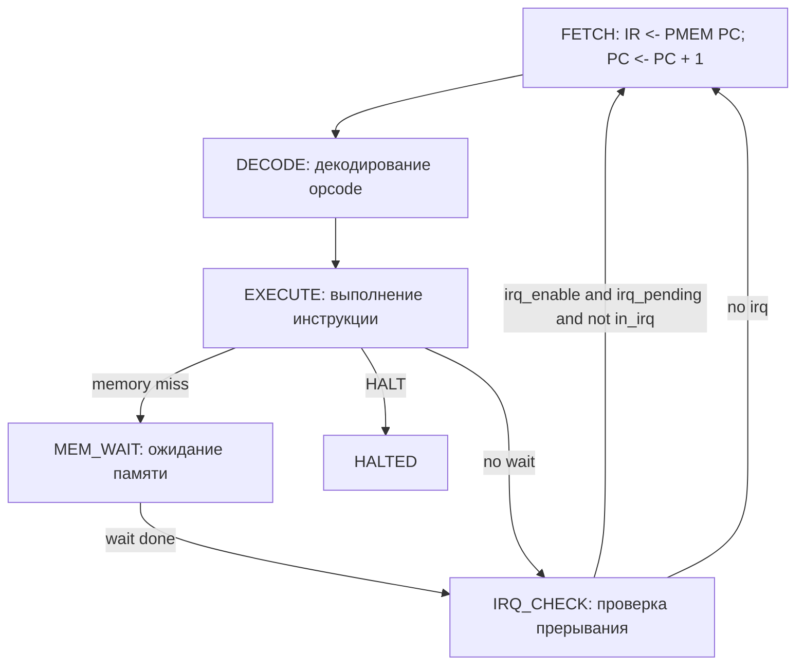

# Лабораторная работа №4. Транслятор и модель процессора

- ФИО: `Бармичев Григорий Андреевич`
- Группа: `P3210`
- Вариант: `forth | stack | harv | hw | tick | binary | trap | mem | pstr | prob1 | cache`
- Язык реализации: Python 3.12+

## Содержание

- [Язык программирования](#язык-программирования)
- [Организация памяти](#организация-памяти)
- [Система команд](#система-команд)
- [Транслятор](#транслятор)
- [Модель процессора](#модель-процессора)
- [DataPath](#datapath)
- [ControlUnit](#controlunit)
- [Ввод-вывод и прерывания](#ввод-вывод-и-прерывания)
- [Кэш](#кэш)
- [Тестирование](#тестирование)
- [Пример работы](#пример-работы)
- [Статистика](#статистика)

## Язык программирования

Разработан минимальный диалект Forth: **MiniForth**. Программа является потоком слов, выполняемых слева направо. Все вычисления выполняются через стек данных. Типизация отсутствует: числа, адреса и символы представлены 32-битными машинными словами.

### Синтаксис

```ebnf
program        ::= { top_item }

top_item       ::= definition
                 | irq_definition
                 | declaration
                 | token

definition     ::= ":" name { token } ";"
irq_definition ::= ":irq" { token } ";"

declaration    ::= "variable" name
                 | "buffer" name integer

token          ::= integer
                 | name
                 | "'" name
                 | "execute"
                 | "if" | "else" | "then"
                 | "begin" | "until"
                 | "dup" | "drop" | "swap" | "over"
                 | "+" | "-" | "*" | "/" | "mod"
                 | "=" | "<" | ">"
                 | "@" | "!"
                 | "ei" | "di" | "iret" | "halt"
                 | "p\"" chars "\""
                 | ".\"" chars "\""

comment        ::= "\\" { any-char-except-newline }
```

### Семантика

- Стратегия вычислений: строгая, последовательная, слева направо.
- Область видимости имён: глобальная. Имена процедур, переменных и буферов находятся в едином словаре.
- Числовые литералы компилируются в `LIT value` и кладутся на стек.
- Имя переменной или буфера компилируется как адрес в памяти данных.
- Имя процедуры компилируется как `CALL address`.
- `' name` кладёт адрес процедуры на стек, `execute` вызывает процедуру по адресу с вершины стека.
- `if/else/then` и `begin/until` являются compile-time словами: транслятор заменяет их переходами `JZ`/`JMP`.
- `:irq ... ;` объявляет обработчик прерывания. Обработчик должен завершаться `iret`.

### Стековые эффекты основных слов

| Слово | Эффект стека | Описание |
|---|---|---|
| `dup` | `( x -- x x )` | дублировать вершину стека |
| `drop` | `( x -- )` | удалить вершину стека |
| `swap` | `( a b -- b a )` | поменять два верхних значения |
| `over` | `( a b -- a b a )` | скопировать второе значение сверху |
| `+` | `( a b -- a+b )` | сложение |
| `-` | `( a b -- a-b )` | вычитание |
| `*` | `( a b -- a*b )` | умножение |
| `/` | `( a b -- a/b )` | целочисленное деление |
| `mod` | `( a b -- a%b )` | остаток от деления |
| `=` `<` `>` | `( a b -- flag )` | сравнение, `0` — false, `1` — true |
| `@` | `( addr -- value )` | чтение из памяти данных/MMIO |
| `!` | `( value addr -- )` | запись в память данных/MMIO |
| `execute` | `( xt -- )` | косвенный вызов процедуры |

### Стандартная библиотека

Файл `src/stdlib.fth` автоматически подключается транслятором перед пользовательской программой и компилируется как обычный MiniForth-код. Библиотека не исполняется Python-кодом напрямую.

Реализованы слова:

- `emit` -- вывести символ;
- `cr`, `space` -- вывести перевод строки или пробел;
- `read-char`, `ack-irq` -- работа с MMIO-регистрами ввода;
- `input-init`, `input-push`, `input-ready?`, `input-pop` -- программный кольцевой буфер ввода;
- `type` -- печать Pascal-строки.

Фрагмент `stdlib.fth`:

```forth
: emit
    out-data !
;

: read-char
    in-data @
;

: ack-irq
    1 irq-ack !
;
```

## Организация памяти

Архитектура гарвардская: память команд и память данных физически разделены. Оба типа памяти используют 32-битное машинное слово. Адресация производится по машинным словам.

```text
Instruction memory
+------------------------------+
| 0000 : JMP main              |
| 0001 : JMP irq_handler       |
| .... : stdlib procedures     |
| .... : user procedures       |
| .... : main                  |
+------------------------------+

Data memory
+------------------------------+
| 0000 : stdlib variables      |
| .... : input buffer          |
| .... : user variables        |
| .... : static pstrings       |
| FFF0 : MMIO_IN_DATA          |
| FFF1 : MMIO_IN_STATUS        |
| FFF2 : MMIO_OUT_DATA         |
| FFF3 : MMIO_IRQ_ACK          |
+------------------------------+

Internal CPU state
+------------------------------+
| PC, IR                       |
| Data Stack                   |
| Return Stack                 |
| irq_enable, irq_pending      |
| in_irq                       |
+------------------------------+
```

### Размещение объектов

- Числовые литералы помещаются непосредственно в инструкции `LIT`.
- Переменные и буферы размещаются статически в памяти данных.
- Статические строки `p"..."` и `."..."` размещаются в памяти данных в формате Pascal string.
- Процедуры размещаются в памяти команд.
- Обработчик прерывания находится в памяти команд и доступен через вектор `1`.
- Стек данных и стек возвратов реализованы как отдельные устройства модели, не как часть памяти данных.

### Pascal-строки

Строка `p"Hi"` размещается так:

```text
addr+0 : 2
addr+1 : 'H'
addr+2 : 'i'
```

`p"..."` кладёт адрес строки на стек. `."..."` кладёт строку в память данных и компилирует вызов `type`.

## Система команд

Процессор имеет стековую ISA. Почти все операции работают с вершиной стека данных. Для вызовов процедур и прерываний используется отдельный стек возвратов.

### Набор инструкций

| Opcode | Мнемоника | Аргумент | Эффект стека | Описание |
|---:|---|---|---|---|
| `0x00` | `nop` | нет | `--` | пустая инструкция |
| `0x01` | `lit` | signed imm24 | `( -- x )` | положить литерал |
| `0x02` | `dup` | нет | `( x -- x x )` | дублировать TOS |
| `0x03` | `drop` | нет | `( x -- )` | удалить TOS |
| `0x04` | `swap` | нет | `( a b -- b a )` | обмен |
| `0x05` | `over` | нет | `( a b -- a b a )` | копия второго значения |
| `0x10` | `add` | нет | `( a b -- a+b )` | сложение |
| `0x11` | `sub` | нет | `( a b -- a-b )` | вычитание |
| `0x12` | `mul` | нет | `( a b -- a*b )` | умножение |
| `0x13` | `div` | нет | `( a b -- a/b )` | деление |
| `0x14` | `mod` | нет | `( a b -- a%b )` | остаток |
| `0x20` | `eq` | нет | `( a b -- flag )` | равно |
| `0x21` | `lt` | нет | `( a b -- flag )` | меньше |
| `0x22` | `gt` | нет | `( a b -- flag )` | больше |
| `0x30` | `load` | нет | `( addr -- value )` | чтение data/MMIO |
| `0x31` | `store` | нет | `( value addr -- )` | запись data/MMIO |
| `0x40` | `jmp` | addr24 | `--` | безусловный переход |
| `0x41` | `jz` | addr24 | `( flag -- )` | переход при `flag == 0` |
| `0x42` | `call` | addr24 | `--` | вызов процедуры |
| `0x43` | `ret` | нет | `--` | возврат |
| `0x44` | `execute` | нет | `( xt -- )` | косвенный вызов |
| `0x50` | `ei` | нет | `--` | разрешить прерывания |
| `0x51` | `di` | нет | `--` | запретить прерывания |
| `0x52` | `iret` | нет | `--` | возврат из IRQ |
| `0xFF` | `halt` | нет | `--` | останов |

### Кодирование инструкций

Каждая инструкция занимает одно 32-битное слово:

```text
31........24 23.................................0
+------------+----------------------------------+
|   opcode   |        immediate / address       |
+------------+----------------------------------+
```

- Старшие 8 бит -- opcode.
- Младшие 24 бита -- аргумент.
- Для `lit` аргумент интерпретируется как signed 24-bit immediate.
- Для `jmp`, `jz`, `call` аргумент интерпретируется как unsigned 24-bit address.
- Для инструкций без аргумента младшие 24 бита равны нулю.
- Сериализация бинарников: big-endian, 4 байта на машинное слово.

Пример листинга:

```text
00000000 - 4000007D - jmp 125
0000007D - 01000046 - lit 70
0000007E - 4200005B - call 91
0000007F - FF000000 - halt
```

## Транслятор

Интерфейс командной строки:

```bash
python src/translator.py <source.fth> <program.bin> <data.bin>
```

Дополнительные параметры:

```bash
--program-hex <path>
--data-hex <path>
```

Если пути для листингов не заданы, они создаются рядом с бинарниками как `program.bin.hex` и `data.bin.hex`.

Этапы трансляции:

1. Загрузка `src/stdlib.fth` и объединение с пользовательской программой.
2. Токенизация: числа, слова, `p"..."`, `."..."`, комментарии `\`.
3. Объявление переменных, буферов, процедур и `:irq`.
4. Генерация псевдо-машинного кода в виде списка `Instruction`.
5. Backpatching для `if/else/then`, `begin/until`, вызовов и execution token.
6. Запись `program.bin`, `data.bin` и человекочитаемых листингов.

Правила генерации:

| MiniForth | Машинный код |
|---|---|
| `42` | `LIT 42` |
| `x`, где `x` переменная | `LIT addr(x)` |
| `word`, где `word` процедура | `CALL addr(word)` |
| `' word` | `LIT addr(word)` |
| `execute` | `EXECUTE` |
| `if` | `JZ ?` |
| `else` | patch `JZ`, emit `JMP ?` |
| `then` | patch последнего перехода |
| `begin` | запомнить текущий адрес |
| `until` | `JZ begin_addr` |
| `p"abc"` | строка в data memory, затем `LIT addr` |
| `."abc"` | строка в data memory, затем `LIT addr`, `CALL type` |

## Модель процессора

Интерфейс командной строки:

```bash
python src/machine.py <program.bin> <data.bin> [input.txt]
```

Опции:

```bash
--limit <ticks>
--log <log.txt>
--output <output.txt>
--cache / --no-cache
--cache-lines <n>
```

Модель выполняется с точностью до такта. Один вызов `step_tick()` продвигает процессор на один такт.

Состояния Control Unit:

```text
FETCH -> DECODE -> EXECUTE -> MEM_WAIT? -> IRQ_CHECK -> FETCH
                                      \-> HALTED
```

Обычная инструкция проходит стадии `FETCH`, `DECODE`, `EXECUTE`, `IRQ_CHECK`. Доступ к памяти данных при промахе кэша добавляет состояние `MEM_WAIT`.

Остановка модели:

- `HALT`;
- превышение лимита тактов;
- ошибка стека;
- некорректный адрес памяти;
- деление на ноль;
- некорректный машинный код.

## DataPath



Основные элементы:

- `PC` -- адрес текущей инструкции.
- `IR` -- текущая инструкция.
- `Data Stack` -- стек операндов.
- `Return Stack` -- адреса возврата процедур и прерываний.
- `ALU` -- арифметика и сравнения.
- `Data Memory` -- память данных.
- `Data Cache` -- кэш данных.
- `MMIO` -- регистры ввода-вывода.
- `Interrupt Controller` -- логика входа в обработчик прерывания.

Программисту доступны только стек данных, память данных через `@`/`!`, процедуры и MMIO-адреса через библиотечные слова.

## ControlUnit



Вход в прерывание происходит на стадии `IRQ_CHECK`. Если прерывания разрешены, устройство ввода подняло `irq_pending`, и процессор не находится внутри обработчика, то текущий `PC` сохраняется на return stack, `PC` устанавливается в `IRQ_VECTOR`, а `irq_enable` сбрасывается.

## Ввод-вывод и прерывания

Вариант использует `trap` и `mem`, поэтому ввод/вывод реализован через memory-mapped регистры и систему прерываний.

| Адрес | Имя | Назначение |
|---:|---|---|
| `0xFFF0` | `MMIO_IN_DATA` | входной символ |
| `0xFFF1` | `MMIO_IN_STATUS` | готовность входного символа |
| `0xFFF2` | `MMIO_OUT_DATA` | запись символа в вывод |
| `0xFFF3` | `MMIO_IRQ_ACK` | подтверждение IRQ |

Формат входного файла:

```text
<tick> <char>
```

Пример:

```text
1000 H
2000 e
3000 l
4000 l
5000 o
6000 \n
```

Устройство ввода имеет один аппаратный регистр. Если новый символ приходит до подтверждения предыдущего через `irq-ack`, символ теряется, а счётчик `input_overruns` увеличивается. Это сделано намеренно: в модели нет скрытой Python-очереди ввода.

Для удобной обработки ввода стандартная библиотека реализует программный кольцевой буфер на 64 символа. Обработчик IRQ обычно выглядит так:

```forth
:irq
    read-char ack-irq input-push iret
;
```

## Кэш

Реализован кэш данных:

- direct-mapped;
- одна ячейка памяти на строку кэша;
- по умолчанию 8 строк;
- write-through;
- write-allocate;
- hit -- 1 такт;
- miss -- 10 тактов доступа к памяти;
- MMIO-адреса не кэшируются.

События кэша видны в журнале как `cache_hit`, `cache_miss`, `cache_wait`. В summary выводится статистика hits/misses.

Пример сравнения `cache_demo`:

```text
cache on : ticks=2061 instructions=475 hits=110 misses=18
cache off: ticks=3051 instructions=475 uncached_reads=83 uncached_writes=45
```

Кэш уменьшает число тактов, не меняя количество исполненных инструкций.

## Тестирование

Интеграционные тесты реализованы через `pytest-golden`:

```bash
pytest tests/test_golden.py
pytest --update-goldens tests/test_golden.py
```

Каждый golden-файл содержит:

- `in_source` -- исходная MiniForth-программа;
- `in_stdin` -- расписание trap-ввода;
- `out_code` -- листинг памяти команд;
- `out_data` -- листинг памяти данных;
- `out_stdout` -- вывод инструментальной цепочки;
- `out_log` -- адаптированный журнал процессора.

Запуск проверок качества:

```bash
ruff format --check .
ruff check .
mypy src tests
pytest tests/test_golden.py
```

CI выполняет те же команды в GitHub Actions.

### Набор golden tests

> После финального коммита заменить `<COMMIT_HASH>` на результат `git rev-parse HEAD`. Ссылки должны быть immutable, то есть вести на конкретный коммит, а не на `main`.

| Тест | Назначение | Ссылка |
|---|---|---|
| `hello` | печать `Hello, world!` | `https://github.com/<USER>/<REPO>/blob/<COMMIT_HASH>/tests/golden/hello.yml` |
| `cat` | печать входных символов | `https://github.com/<USER>/<REPO>/blob/<COMMIT_HASH>/tests/golden/cat.yml` |
| `hello_user_name` | запрос имени и приветствие | `https://github.com/<USER>/<REPO>/blob/<COMMIT_HASH>/tests/golden/hello_user_name.yml` |
| `sort` | сортировка однозначных чисел | `https://github.com/<USER>/<REPO>/blob/<COMMIT_HASH>/tests/golden/sort.yml` |
| `wide` | арифметика двойной точности | `https://github.com/<USER>/<REPO>/blob/<COMMIT_HASH>/tests/golden/wide.yml` |
| `prob1` | Project Euler Problem 1 | `https://github.com/<USER>/<REPO>/blob/<COMMIT_HASH>/tests/golden/prob1.yml` |
| `cache_demo` | демонстрация кэша | `https://github.com/<USER>/<REPO>/blob/<COMMIT_HASH>/tests/golden/cache_demo.yml` |
| `xt_demo` | execution token | `https://github.com/<USER>/<REPO>/blob/<COMMIT_HASH>/tests/golden/xt_demo.yml` |
| `irq_echo` | trap-прерывание | `https://github.com/<USER>/<REPO>/blob/<COMMIT_HASH>/tests/golden/irq_echo.yml` |
| `arithmetic` | дополнительная арифметическая проверка | `https://github.com/<USER>/<REPO>/blob/<COMMIT_HASH>/tests/golden/arithmetic.yml` |

## Пример работы

Исходный код `examples/hello.fth`:

```forth
\ hello

."Hello, world!\n"
halt
```

Запуск:

```bash
python src/translator.py examples/hello.fth program.bin data.bin
python src/machine.py program.bin data.bin --log hello.log
```

Вывод:

```text
Hello, world!
summary: ticks=1780 instructions=... cache=on hits=... misses=... uncached_reads=0 uncached_writes=0 input_overruns=0
```

Фрагмент листинга команд:

```text
00000000 - 4000007D - jmp 125
00000001 - 40000081 - jmp 129
...
0000007D - 01000046 - lit 70
0000007E - 4200005B - call 91
0000007F - FF000000 - halt
```

Фрагмент журнала:

```text
DEBUG   machine:simulation    TICK:     0 PC:     1 STATE: decode    MODE: user DS: []               RS: []               IE:0 IP:0 CACHE:0/0    jmp 125 [fetch @00000000]
DEBUG   machine:simulation    TICK:     1 PC:     1 STATE: execute   MODE: user DS: []               RS: []               IE:0 IP:0 CACHE:0/0    jmp 125 [decode jmp 125]
DEBUG   machine:simulation    TICK:     2 PC:   125 STATE: irq_check MODE: user DS: []               RS: []               IE:0 IP:0 CACHE:0/0    jmp 125 [jmp 0x0000007D]
```

## Статистика

Статистика получена по golden tests. `code bytes` считается как `code instr * 4`, так как одна инструкция занимает 4 байта.

| Алгоритм | LoC | code instr | code bytes | data cells | ticks | Назначение |
|---|---:|---:|---:|---:|---:|---|
| `arithmetic` | 7 | 143 | 572 | 92 | 1221 | проверка арифметики |
| `cache_demo` | 18 | 164 | 656 | 96 | 2061 | демонстрация кэша |
| `cat` | 14 | 148 | 592 | 70 | 6383 | ввод/вывод через trap |
| `hello` | 2 | 130 | 520 | 85 | 1780 | Hello world |
| `hello_user_name` | 30 | 182 | 728 | 135 | 17329 | ввод строки имени |
| `irq_echo` | 11 | 145 | 580 | 71 | 892 | обработчик IRQ |
| `prob1` | 12 | 159 | 636 | 96 | 1771 | Project Euler 1 |
| `sort` | 55 | 273 | 1092 | 92 | 14624 | сортировка |
| `wide` | 29 | 190 | 760 | 102 | 1946 | двойная точность |
| `xt_demo` | 10 | 142 | 568 | 86 | 866 | execution token |
