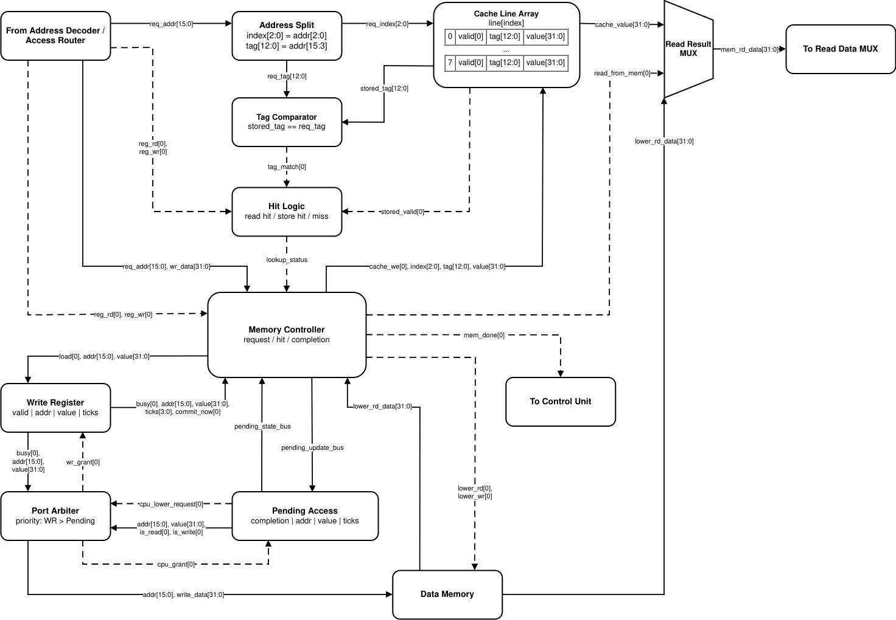

# Лабораторная работа №4. Транслятор и модель процессора

- ФИО: `Бармичев Григорий Андреевич`
- Группа: `P3210`
- Вариант: `forth | stack | harv | hw | tick | binary | trap | mem | pstr | prob1 | cache`
- Язык реализации: Python 3.12+

Проект реализует сквозную инструментальную цепочку: транслятор минимального Forth формирует раздельные бинарные образы Program Memory и Data Memory, после чего потактовая модель стекового процессора исполняет их с MMIO, trap-прерываниями и восьмистрочным data cache.

## Содержание

- [Соответствие варианту](#соответствие-варианту)
- [Язык программирования](#язык-программирования)
- [Организация памяти](#организация-памяти)
- [Система команд](#система-команд)
- [Транслятор](#транслятор)
- [Модель процессора](#модель-процессора)
- [Ввод-вывод MMIO и прерывания](#ввод-вывод-mmio-и-прерывания)
- [Кэш](#кэш)
- [Тестирование](#тестирование)
- [Примеры работы](#примеры-работы)
- [Статистика](#статистика)

## Соответствие варианту

| Пункт | Реализация |
|---|---|
| `forth` | минимальный Forth с процедурами, RPN, `execution token`, `if/else/then`, `begin/until` |
| `stack` | Data Stack для операндов и отдельный Return Stack для адресов возврата |
| `harv` | раздельные `program.bin` и `data.bin`, отдельные Program Memory и Data Memory |
| `hw` | hardwired Control Unit, комбинационный Opcode Classifier и FSM без микрокода |
| `tick` | `Machine.step_tick()` выполняет один фронт FSM; журнал содержит переход `old_state -> new_state` |
| `binary` | настоящие big-endian бинарные файлы по 4 байта на слово и текстовые `.hex`-листинги |
| `trap` | расписание входных событий по тактам, программный обработчик `:irq`, `ready/overrun` |
| `mem` | memory-mapped I/O через обычные `load/store` |
| `pstr` | статические Pascal strings: длина, затем по одному символу в слове |
| `prob1` | Project Euler Problem 4 в `examples/prob1.fth` |
| `cache` | восьмистрочный direct-mapped data cache, write-through/write-allocate, один Write Register |

## Язык программирования

Реализован минимальный диалект Forth. Программа состоит из потока слов. Все вычисления выполняются через стек данных. Поддержаны процедуры, переменные, буферы, условные переходы, циклы `begin/until`, строки с префиксом длины, обработчик прерывания и `execution token`.

### Синтаксис

Синтаксис описан в расширенной форме Бэкуса-Наура.

```ebnf
program        = { top-item } ;

top-item       = definition
               | irq-definition
               | declaration
               | word ;

definition     = ":" , name , { word } , ";" ;
irq-definition = ":irq" , { word } , ";" ;

declaration    = "variable" , name
               | "buffer" , name , integer ;

word           = integer
               | name
               | "'" , name
               | "execute"
               | "if" | "else" | "then"
               | "begin" | "until"
               | "dup" | "drop" | "swap" | "over"
               | "+" | "-" | "*" | "/" | "mod"
               | "=" | "<" | ">"
               | "@" | "!"
               | "ei" | "di" | "iret" | "halt"
               | pstring
               | print-string ;

pstring        = "p\"" , { string-char } , "\"" ;
print-string   = ".\"" , { string-char } , "\"" ;
name           = letter , { letter | digit | "-" | "_" | "?" | "!" } ;
integer        = [ "-" ] , digit , { digit } ;
comment        = "\\" , { any-char-except-newline } , newline ;
```

Имена пользовательских процедур, переменных и буферов проверяются регулярным выражением
`[A-Za-z][A-Za-z0-9_?!-]*`. Числовые литералы строго десятичные: допускаются только цифры и необязательный ведущий `-`; префиксы `0x`/`0o`, знак `+` и подчёркивания не поддерживаются. Имена служебных объектов стандартной библиотеки с префиксом `__` разрешены только внутри `src/stdlib.fth`.

### Семантика

#### Стратегия вычислений

Вычисления строгие и последовательные. Слова выполняются слева направо. Операнды передаются через стек данных: числовой литерал кладёт значение на стек, арифметическая операция снимает аргументы со стека и кладёт результат обратно.

#### Области видимости

Все имена глобальные. Процедуры, переменные и буферы находятся в одной области имён. Повторное объявление имени запрещено. Локальные переменные не поддерживаются.

#### Типизация

Типизация отсутствует. Все значения представлены 32-битными машинными словами. Одно и то же слово может интерпретироваться как число, адрес, символ или флаг. Для логических значений используется соглашение: `0` -- ложь, `1` -- истина.

#### Строки `pstr`

Строки хранятся в памяти данных в формате Pascal string: первая ячейка содержит длину строки, следующие ячейки -- коды символов. Один символ занимает одну 32-битную ячейку.

```text
p"Hi"

addr + 0 : 2
addr + 1 : 72   ('H')
addr + 2 : 105  ('i')
```

Слово `p"..."` размещает строку в памяти данных и кладёт её адрес на стек. Для вывода строки используется библиотечная процедура `type`. Слово `."..."` является синтаксическим сокращением: оно размещает Pascal-строку в памяти данных и сразу генерирует вызов `type`. Строковые литералы ограничены однобайтовыми символами `0..255`; символы, не представимые в Latin-1, отклоняются транслятором. Распознаются escape-последовательности `\n`, `\r`, `\t`, `\0`, `\\` и `\"`.

#### Комментарии

Комментарий начинается с символа `\` и продолжается до конца строки.

## Организация памяти

Архитектура гарвардская: память команд и память данных разделены. Обе памяти адресуются по 32-битным словам. В бинарном файле одно слово хранится как 4 байта, но внутри модели адрес -- это номер слова, а не байтовый адрес.

### Память команд

```text
Program memory
+------------------------------+
| 0000 : jmp main              |
| 0001 : jmp irq_handler       |
| .... : stdlib procedures     |
| .... : user procedures       |
| .... : main                  |
+------------------------------+
```

Адрес `0` используется как reset vector. Адрес `1` используется как interrupt vector. Далее размещаются процедуры стандартной библиотеки, пользовательские процедуры и основной код программы.

Поля адресов в `jmp`, `jz` и `call` имеют ширину 24 бита, но сама Python-модель не выполняет циклическое маскирование `PC`. Перед выборкой, переходом, возвратом и вызовом проверяется условие `0 <= address < len(program_memory)`; выход за фактический образ программы приводит к `MachineError`. Инструкция `execute` проверяет полное 32-битное значение `TOS` до изменения `PC`, Data Stack и Return Stack, поэтому недопустимый execution token не обрезается до младших 24 бит.

### Память данных

Используется единое 16-битное адресное пространство из `2^16 = 65536` адресов. Адрес остаётся
пословным: один адрес выбирает одно 32-битное слово. Верхние адреса зарезервированы под MMIO.

```text
Data address space
+-----------------------------------+
| 0000 : stdlib variables           |
| .... : input buffer               |
| .... : user variables/buffers     |
| .... : static pstrings            |
| FFEF : last regular memory word   |
| FFF0 : MMIO_IN_DATA               |
| FFF1 : MMIO_IN_STATUS             |
| FFF2 : MMIO_OUT_DATA              |
| FFF3 : MMIO_IRQ_ACK               |
| FFF4..FFFF : reserved/unmapped     |
+-----------------------------------+
```

Статический образ `data.bin` обязан полностью находиться ниже `0xFFF0`. И транслятор, и загрузчик модели отклоняют образ, пересекающийся с MMIO. Массив regular memory имеет ровно `REGULAR_MEMORY_SIZE = 0xFFF0` слов и дополняется нулями только до последнего обычного адреса `0xFFEF`; MMIO и reserved-диапазон не представлены фиктивными ячейками списка, а обрабатываются `Address Decoder / Access Router`.

Строковые литералы, переменные и буферы размещаются статически на этапе трансляции. Обычные адреса
памяти данных проходят через cache. MMIO распознаётся декодером адреса до cache и никогда не
кешируется.

### Стеки

Процессор использует два стека.

- `Data Stack` -- основной стек операндов. В модели он представлен `list[int]`; `SP` вычисляется как
  длина списка, а аппаратные `TOS` и `NOS` соответствуют двум верхним элементам. Операции `push`,
  `pop` и `peek` выполняют проверки overflow/underflow в классе `Machine`.
- `Return Stack` -- отдельный список адресов возврата для `call`, `ret`, `execute`, входа в IRQ и
  `iret`.

Списки являются функциональной моделью аппаратных стеков. На схеме `Data Stack`, `Return Stack`, `SP`,
`TOS` и `NOS` остаются самостоятельными аппаратными элементами независимо от представления в Python.

## Система команд

### Особенности ISA

- **Архитектура:** стековая.
- **Машинное слово:** одна инструкция и одна ячейка данных занимают 32 бита.
- **Адресация:** адрес указывает на 32-битное слово.
- **Доступ к памяти:** память данных доступна через `load` и `store`.
- **Поток управления:** переходы выполняются инструкциями `jmp`, `jz`, `call`, `ret`, `execute`, `iret`.
- **Ввод-вывод:** memory-mapped, специальных инструкций `in/out` нет. Устройства доступны обычными `load/store` по MMIO-адресам.

### Кодирование инструкций

Каждая инструкция занимает одно 32-битное слово.

```text
31          24 23                          0
+-------------+----------------------------+
| opcode: 8   | arg: 24                    |
+-------------+----------------------------+
```

В бинарных файлах `program.bin` и `data.bin` каждое машинное слово записывается как 4 байта в порядке **big-endian**. Внутри модели адресация остаётся пословной: адрес указывает на номер 32-битного слова. В `.hex`-листингах то же слово отображается как 8 шестнадцатеричных цифр.

Непосредственный аргумент `lit` является знаковым 24-битным значением
`[-8388608, 8388607]`. Значение вне этого диапазона отклоняется непосредственно транслятором с
указанием исходной позиции, а не на стадии записи бинарного файла.

В процессоре `IR` остаётся одним сырым 32-битным регистром. Его выход аппаратно разделяется на поля:

```text
opcode = IR[31:24]
arg    = IR[23:0]
```

Поле `opcode` поступает в комбинационный `Opcode Classifier`. Поле `arg` для `lit` проходит через
знаковое расширение 24→32, а для `jmp`, `jz` и `call` используется как беззнаковый адрес. Отдельного
регистра декодированной инструкции нет.

### Набор инструкций

| Opcode | Мнемоника | Аргумент     | Эффект стека        | Описание                           |
| -----: | --------- | ------------ | ------------------- | ---------------------------------- |
| `0x00` | `nop`     | нет          | `--`                | пустая операция                    |
| `0x01` | `lit`     | signed imm24 | `( -- x )`          | положить литерал                   |
| `0x02` | `dup`     | нет          | `( x -- x x )`      | дублировать вершину                |
| `0x03` | `drop`    | нет          | `( x -- )`          | удалить вершину                    |
| `0x04` | `swap`    | нет          | `( a b -- b a )`    | обменять два верхних значения      |
| `0x05` | `over`    | нет          | `( a b -- a b a )`  | скопировать второе значение сверху |
| `0x10` | `add`     | нет          | `( a b -- a+b )`    | сложение                           |
| `0x11` | `sub`     | нет          | `( a b -- a-b )`    | вычитание                          |
| `0x12` | `mul`     | нет          | `( a b -- a*b )`    | умножение                          |
| `0x13` | `div`     | нет          | `( a b -- a/b )`    | целочисленное деление              |
| `0x14` | `mod`     | нет          | `( a b -- a%b )`    | остаток от деления                 |
| `0x20` | `eq`      | нет          | `( a b -- flag )`   | равно                              |
| `0x21` | `lt`      | нет          | `( a b -- flag )`   | меньше                             |
| `0x22` | `gt`      | нет          | `( a b -- flag )`   | больше                             |
| `0x30` | `load`    | нет          | `( addr -- value )` | чтение памяти данных или MMIO      |
| `0x31` | `store`   | нет          | `( value addr -- )` | запись в память данных или MMIO    |
| `0x40` | `jmp`     | addr24       | `--`                | безусловный переход                |
| `0x41` | `jz`      | addr24       | `( flag -- )`       | переход, если `flag = 0`           |
| `0x42` | `call`    | addr24       | `--`                | вызов процедуры                    |
| `0x43` | `ret`     | нет          | `--`                | возврат из процедуры               |
| `0x44` | `execute` | нет          | `( xt -- )`         | косвенный вызов процедуры          |
| `0x50` | `ei`      | нет          | `--`                | разрешить прерывания               |
| `0x51` | `di`      | нет          | `--`                | запретить прерывания               |
| `0x52` | `iret`    | нет          | `--`                | возврат из обработчика IRQ         |
| `0xFF` | `halt`    | нет          | `--`                | останов процессора                 |

### Длительности выполнения инструкций

Один вызов `Machine.step_tick()` соответствует одному переходу hardwired FSM и одному фронту такта.
Отдельного состояния `DECODE` нет: после загрузки сырого слова в `IR` поле `opcode[7:0]`
комбинационно классифицируется между фронтами. Обычная инструкция выполняется так:

```text
FETCH -> EXECUTE -> IRQ_CHECK
```

| Стадия | Тактов | Действие |
|---|---:|---|
| `FETCH` | 1 | `IR <- program_memory[PC]`, `PC <- PC + 1`, переход в `EXECUTE` |
| `EXECUTE` | 1 | комбинационное декодирование `IR`, выполнение простой инструкции либо cache lookup/запуск памяти |
| `IRQ_CHECK` | 1 | приём pending IRQ только на границе инструкций |

Память команд внутри процессора хранит сырые 32-битные слова. `decode_instruction(IR)` вызывается
локально в `EXECUTE`; ошибки ISA преобразуются в `MachineError`.

| Случай | Полный цикл инструкции |
|---|---:|
| ALU, стек, переход, `LOAD/STORE` MMIO | 3 такта |
| `LOAD` cache hit | 3 такта |
| `STORE` cache hit при свободном write register | 3 такта |
| cache miss или cache disabled | 13 тактов: `FETCH + EXECUTE/cache lookup + 10 MEM_WAIT + IRQ_CHECK` |
| `STORE` hit при занятом write register | 3 такта плюс ожидание освобождения регистра |
| `halt` без незавершённой записи | 2 такта; `IRQ_CHECK` после остановки не выполняется |

Для cache miss cache lookup занимает один такт `EXECUTE`, затем нижняя память получает ровно десять
тактов в состоянии `MEM_WAIT`. Если Write Register владеет однопортовой памятью, счётчик pending
access не уменьшается.

`halt` запрещает выборку новых инструкций, но модель продолжает тактировать Write Register до commit,
чтобы backing memory не потеряла принятую write-through запись.

### Стандартная библиотека

Файл `src/stdlib.fth` автоматически подключается транслятором перед пользовательской программой и компилируется как обычный код.

| Слово          | Назначение                                      |
| -------------- | ----------------------------------------------- |
| `emit`         | вывести один символ через `MMIO_OUT_DATA`       |
| `cr`, `space`  | вывести перевод строки или пробел               |
| `read-char`    | прочитать символ из `MMIO_IN_DATA`              |
| `ack-irq`      | подтвердить обработку входного прерывания       |
| `input-init`   | инициализировать программный буфер ввода        |
| `input-push`   | положить символ в буфер ввода                   |
| `input-ready?` | проверить наличие символа в буфере              |
| `input-pop`    | извлечь символ из буфера                        |
| `wait-char`    | дождаться символа в программном буфере          |
| `digit?`       | проверить, является ли символ десятичной цифрой |
| `read-number`  | прочитать знаковое десятичное число             |
| `print-int`    | напечатать знаковое 32-битное число, включая `-2^31` |
| `type`         | вывести Pascal-строку                           |

## Транслятор

Интерфейс командной строки:

```bash
python src/translator.py <source.fth> <program.bin> <data.bin> \
    [--program-hex <program.hex>] [--data-hex <data.hex>]
```

По умолчанию создаются:

```text
program.bin      бинарная память команд
data.bin         бинарная память данных
program.bin.hex  человекочитаемый листинг команд
data.bin.hex     человекочитаемый листинг данных
```

Этапы трансляции:

1. Раздельная токенизация `src/stdlib.fth` и пользовательского файла с сохранением имени файла,
   строки и столбца для сообщений об ошибках.
2. Проверка имён, объявлений `variable`/`buffer`, процедур `: ... ;` и `:irq ... ;`.
3. Статическое размещение переменных, буферов и Pascal-строк ниже MMIO; размер буфера проверяется до создания нулевого списка.
4. Генерация инструкций с немедленной проверкой возможности бинарного кодирования.
5. Разрешение адресов процедур, переходов и execution token через fixups.
6. Запись binary и человекочитаемых листингов.

Правила генерации кода:

- литерал компилируется в `lit value`; значение обязано помещаться в signed imm24;
- имя переменной или буфера компилируется как `lit address`;
- `@`/`!` компилируются в обычные `load`/`store`, включая MMIO;
- вызов пользовательского слова компилируется в `call address`;
- определение `: name ... ;` завершается `ret`;
- `' name` компилируется как `lit address(name)`; для безопасных встроенных примитивов создаётся
  trampoline `primitive; ret`;
- execution token для `iret` и `halt` запрещён, поскольку эти инструкции не имеют обычной семантики
  возврата из косвенного вызова;
- `execute` является косвенным `call`: сохраняет адрес возврата в Return Stack и переходит по token;
- `if/else/then` компилируются через `jz`/`jmp`, `begin/until` -- через обратный `jz`; единый стек `ControlFrame` запрещает повторный `else` и перекрещённую вложенность конструкций;
- `p"..."` создаёт статическую однобайтовую Pascal-строку, `."..."` дополнительно генерирует вызов `type`;
- при отсутствии `:irq` создаётся обработчик, записывающий `IRQ_ACK_READY` в `MMIO_IRQ_ACK` и выполняющий `iret`.

## Модель процессора

Интерфейс командной строки:

```bash
python src/machine.py <program.bin> <data.bin> [input.txt] \
    [--limit <hard-limit>] [--log <log.txt>] [--output <output.txt>] \
    [--cache | --no-cache]
```

- `--limit` задаёт защитный предел тактов; превышение является ошибкой, а не нормальной паузой;
- `--log` сохраняет полный потактовый журнал;
- `--output` сохраняет вывод программы;
- `--cache`/`--no-cache` включает или выключает восьмистрочный cache данных.

### Начальная установка

Runtime-reset не поддерживается. Создание нового `Machine` играет роль power-on initialization:

```text
PC = RESET_VECTOR = 0
state = FETCH
IR = empty
Data Stack / Return Stack = empty
IE = 0, IN_IRQ = 0
cache valid bits = 0
Write Register = empty
Pending Access = empty
Input IRQ Controller: ready = 0, overrun = 0
```

`program.bin` и `data.bin` загружаются окружением до запуска. Повторный cold start выполняется созданием нового экземпляра модели.

### Честный tick

Один вызов `step_tick()` соответствует одному фронту модели. Порядок действий внутри такта фиксирован:

1. автономно тактируется `MemorySubsystem`: Write Register и текущий Pending Access конкурируют за один порт Data Memory;
2. если CPU не находится в `HALTED`, доставляются входные события текущего такта;
3. выполняется ровно одно состояние CPU FSM: `FETCH`, `EXECUTE`, `MEM_WAIT` или `IRQ_CHECK`;
4. фиксируются новое состояние и строка журнала, затем увеличивается `tick_counter`.

Write Register продолжает дренироваться и после выполнения `halt`. Поэтому `run()` заканчивается, только когда `state = HALTED` и регистр записи пуст.

### Формат журнала

Каждая строка показывает выполненную фазу и состояние после фронта:

```text
TICK PC STATE(old->new) MODE SP DS RS IRQ CACHE WR instruction [event]
```

- `STATE` показывает фактический переход FSM;
- на `FETCH` инструкция отображается как raw 32-bit word, затем как мнемоника;
- `IRQ` объединяет `E` (`irq_enable`), `P` (`irq_pending`) и `S` (`MMIO_IN_STATUS`);
- `CACHE` показывает накопленные hits/misses;
- `WR` показывает `off`, `empty` либо `busy@remaining_ticks`;
- событие поясняет cache hit/miss, владельца порта, ожидание и commit.

### DataPath


Исходник схемы: [`fig/datapath.drawio`](fig/datapath.drawio).

Основные блоки: Program Memory, `PC`, сырой 32-битный `IR`, Data Stack, Return Stack, ALU, `Address Decoder / Access Router`, MMIO, `Data Cache / Memory Controller`, Data Memory и мультиплексоры следующего PC и обратной записи.

Поля `opcode[7:0] = IR[31:24]` и `arg[23:0] = IR[23:0]` являются комбинационными срезами IR. Для `lit` аргумент знаково расширяется до 32 бит; для `jmp`, `jz` и `call` используется как беззнаковый адрес.

`Address Decoder / Access Router` соответствует функции `decode_address()`. Он принимает полный `TOS[31:0]`, выделяет regular/MMIO/invalid region и не пропускает MMIO через cache. Ошибка адреса или неправильное направление доступа к MMIO обнаруживается до изменения Data Stack.

Инструкция `execute` также проверяет полный 32-битный `TOS`: должно выполняться `0 <= target < len(program_memory)`. Только после успешной проверки на одном фронте выполняются `Return Stack.push(PC)`, `Data Stack.pop()` и `PC <- target`; простого обрезания до 24 бит нет.

Синие пунктирные линии на схеме -- концептуальные выходы Control Unit:

| Сигнал | Назначение |
|---|---|
| `ir_latch` | загрузить raw instruction в IR |
| `pc_latch`, `pc_sel` | записать выбранный источник в PC |
| `stack_op` | выполнить атомарное преобразование Data Stack |
| `rs_op` | push/pop Return Stack |
| `alu_op` | выбрать операцию ALU |
| `wb_sel` | выбрать ALU, sign-extended literal или read data |
| `mem_rd`, `mem_wr` | инициировать одно обращение к MemorySubsystem |

### Control Unit


Исходник схемы: [`fig/control_unit.drawio`](fig/control_unit.drawio).

Control Unit -- hardwired FSM без control store и без отдельного состояния `DECODE`.

| Блок схемы | Реализация в коде |
|---|---|
| `State Register` | `Machine.control_state` |
| `Opcode Classifier` | `classify_opcode()`; special case `HALT`, остальные классы по старшей тетраде |
| `Control Signal Generator` | `_tick_execute()` и `_execute_stack/_alu/_memory/_flow/_irq()` |
| `Next-State Logic` | переходы в `_tick_fetch()`, `_finish_instruction()`, `_tick_mem_wait()`, `_tick_irq_check()` |
| `IRQ Control / Flags` | `irq_enable`, `in_irq`, `_execute_irq()`, `_tick_irq_check()` |

Точные переходы FSM:

| Текущее состояние | Условие | Следующее состояние |
|---|---|---|
| `FETCH` | инструкция выбрана | `EXECUTE` |
| `EXECUTE` | обычная инструкция или завершённый MMIO/cache hit | `IRQ_CHECK` |
| `EXECUTE` | незавершённый `LOAD/STORE` | `MEM_WAIT` |
| `EXECUTE` | `HALT` | `HALTED` |
| `MEM_WAIT` | память ещё не ответила | `MEM_WAIT` |
| `MEM_WAIT` | получен завершённый response | `IRQ_CHECK` |
| `IRQ_CHECK` | независимо от наличия IRQ | `FETCH` |
| `HALTED` | CPU остановлен | `HALTED` до опустошения Write Register |

`mem_done` и `mmio_done` -- однотактовые статусы завершения regular-memory и MMIO access. В Python они представлены `MemoryResponse(done=True)`, а на схеме вынесены как отдельные аппаратные линии.

IRQ принимается, когда:

```text
current_state = IRQ_CHECK
and IE = 1
and irq_pending = 1
and IN_IRQ = 0
```

На входе в обработчик текущий `PC` сохраняется в Return Stack, `PC <- IRQ_VECTOR`, `IE <- 0`, `IN_IRQ <- 1`.

## Ввод-вывод MMIO и прерывания

Ввод-вывод реализован как memory-mapped I/O. Специальных команд `in/out` нет: Forth-слова используют обычные `@` и `!`, которые транслируются в `load/store`.

| Адрес | Имя | Доступ | Назначение |
|---:|---|---|---|
| `0xFFF0` | `MMIO_IN_DATA` | read-only | текущий входной байт |
| `0xFFF1` | `MMIO_IN_STATUS` | read-only | bit 0 `ready`, bit 1 `overrun` |
| `0xFFF2` | `MMIO_OUT_DATA` | write-only | вывести младший байт значения |
| `0xFFF3` | `MMIO_IRQ_ACK` | write-only | bit 0 очистить `ready`, bit 1 очистить `overrun` |

Чтение write-only регистра, запись в read-only регистр и обращение к reserved-адресу приводят к `MachineError`.

Входной файл содержит пары `tick token`, например:

```text
10 H
40 i
70 \n
```

В начале указанного такта `InputIrqController.push_token()` пытается защёлкнуть один байт. Если `ready = 0`, обновляются `data` и `ready`; `irq_pending` не хранится отдельно и комбинационно равен `ready`. Если новый токен приходит при уже установленном `ready`, старый байт сохраняется, устанавливается `overrun` и увеличивается `overrun_count`: магической очереди внутри устройства нет.

Программа разрешает прерывания командой `ei`. CPU проверяет IRQ только в состоянии `IRQ_CHECK`, то есть после полного завершения текущей инструкции, включая cache miss. При входе `PC` помещается в Return Stack, а переход выполняется на `IRQ_VECTOR = 1`. `iret` разрешён только внутри обработчика, восстанавливает адрес возврата, снимает `IN_IRQ` и снова устанавливает `IE`.

Обработчик `:irq` пишется на Forth и обязан явно оканчиваться словом `iret`; это проверяется транслятором. Если обработчик не задан, создаётся безопасный default handler: он записывает `IRQ_ACK_READY` в `MMIO_IRQ_ACK` и выполняет `iret`.

Программа `cat` хранит входные символы в программном кольцевом буфере стандартной библиотеки и завершается после `\n`. Аппаратный `overrun` доступен программе через `MMIO_IN_STATUS`.

## Кэш

Реализован восьмистрочный direct-mapped Data Cache. Program Memory является отдельной однотактной Harvard memory и не кешируется; MMIO обходит cache через Address Router.



Исходник схемы: [`fig/cache.drawio`](fig/cache.drawio).

На cache-схеме чёрные сплошные линии обозначают адреса, данные и составные шины; чёрные пунктирные -- внутренние управляющие и статусные сигналы.

### Параметры и блоки

- 8 строк, одна строка содержит одно 32-битное слово;
- формат строки: `valid[0] | tag[12:0] | value[31:0]`;
- `index[2:0] = address[2:0]`, `tag[12:0] = address[15:3]`;
- политика записи: write-through и write-allocate;
- алгоритм вытеснения не выбирается: при miss всегда заменяется единственная строка `line[index]`;
- dirty bit не нужен, поскольку изменённое значение синхронизируется с backing memory;
- для store hit используется один аппаратный Write Register, а не FIFO/write buffer;
- blocking miss хранится в отдельном `PendingAccess` внутри Memory Controller.

| Блок схемы | Реализация в коде |
|---|---|
| `Address Split` | `DataCache.split_address()` |
| `Cache Line Array` | `DataCache.lines: list[CacheLine]` |
| `Tag Comparator / Hit Logic` | `lookup()`, `read()`, `probe_write()` |
| `Memory Controller` | `MemorySubsystem.request_*()`, `tick()`, `_complete_pending_access()` |
| `Write Register` | `WriteRegister` |
| `Pending Access` | `PendingAccess | None` |
| `Port Arbiter` | приоритет `wr_owns_port` внутри `MemorySubsystem.tick()` |
| `Data Memory` | `MemorySubsystem.words[0:0xFFF0]` |

### Именованные шины на схеме

Шины на схеме являются группировкой аппаратных сигналов, а не отдельными Python-объектами.

| Шина или сигнал | Логический состав |
|---|---|
| request data | `req_addr[15:0]`, `wr_data[31:0]` |
| request control | `reg_rd[0]`, `reg_wr[0]` |
| `lookup_status` | `read_hit[0]`, `store_hit[0]`, `miss[0]` |
| cache update | `cache_we[0]`, `index[2:0]`, `tag[12:0]`, `value[31:0]` |
| WR load | `load[0]`, `addr[15:0]`, `value[31:0]` |
| WR state | `busy[0]`, `addr[15:0]`, `value[31:0]`, `ticks[3:0]`, `commit_now[0]` |
| `pending_update_bus` | `load/clear`, `completion`, `addr`, `write_value`, `ticks` |
| `pending_state_bus` | `valid`, `completion`, `addr`, `write_value`, `ticks`, `complete_now` |
| WR port request | `busy[0]`, `addr[15:0]`, `value[31:0]` |
| pending port request | `addr[15:0]`, `value[31:0]`, `is_read[0]`, `is_write[0]` |
| lower-memory data | `addr[15:0]`, `write_data[31:0]` |
| lower-memory control | `lower_rd[0]`, `lower_wr[0]` |
| `read_from_mem[0]` | `0` -- выбрать `cache_value`, `1` -- выбрать `lower_rd_data` |
| `mem_done[0]` | однотактовый импульс завершения запроса CPU |

Для `Pending Access` аппаратный `valid` соответствует условию `pending_access is not None`. Поле `completion` принимает `CACHE_READ_MISS`, `CACHE_WRITE_MISS` или `CACHE_HIT_WRITE_REGISTER`; на схеме они сокращены до `READ_MISS`, `WRITE_MISS`, `STORE_HIT_WAIT_WR`. При cache disabled также используются `MEMORY_READ` и `MEMORY_WRITE`.

`pending_update_bus` концептуально задаёт `HOLD/LOAD/CLEAR` и значения, которые следует защёлкнуть. `pending_state_bus` возвращает сохранённые поля и вычисляемый статус:

```text
pending_complete_now = cpu_grant and remaining_ticks == 1
```

Аналогично для Write Register:

```text
wr_commit_now = wr_grant and remaining_ticks == 1
```

### Чтение

При `LOAD hit` выбранное значение `cache_value` через Read Result MUX возвращается в DataPath на такте `EXECUTE`; `mem_done = 1`, состояние `MEM_WAIT` не используется.

При `LOAD miss` создаётся `PendingAccess(CACHE_READ_MISS, address, remaining_ticks=10)`. Каждый такт, когда CPU получает порт, уменьшает счётчик. На последнем grant Data Memory читается, строка cache заполняется, Read Result MUX выбирает `lower_rd_data`, а CPU получает однотактовый `mem_done`.

### Запись

- `STORE hit`, WR свободен: cache line обновляется, адрес/значение загружаются в Write Register, CPU сразу получает `mem_done`;
- `STORE hit`, WR занят: создаётся `CACHE_HIT_WRITE_REGISTER`; инструкция ждёт освобождения регистра, но не запрашивает порт Data Memory;
- `STORE miss`: создаётся blocking `CACHE_WRITE_MISS` на 10 granted ticks; на завершении значение записывается в backing memory и одновременно выполняется write-allocate;
- при cache disabled обычные read/write выполняются через `MEMORY_READ/MEMORY_WRITE` с той же задержкой нижней памяти.

### Однопортовый арбитр

В начале каждого такта фиксируется:

```text
wr_owns_port = write_register.busy
```

Если WR был занят в начале такта, он получает порт, даже если commit произойдёт на этом же фронте. Pending lower-memory access в этот такт grant не получает. При этом ожидающий `STORE_HIT_WAIT_WR` может на том же фронте загрузить уже освободившийся Write Register, потому что загрузка регистра не использует порт RAM.

Финальный доступ к массиву Data Memory выполняется только на последнем granted tick:

```text
lower_rd = pending_complete_now and pending_is_read
lower_wr = wr_commit_now
        or (pending_complete_now and pending_is_write)
```

### Задержки

```text
cache hit  = 1 tick cache lookup
cache miss = 1 tick cache lookup + 10 granted ticks Data Memory
```

Полный цикл обычной инструкции -- 3 CPU ticks. Cache miss добавляет десять `MEM_WAIT`, то есть `FETCH + EXECUTE + 10 × MEM_WAIT + IRQ_CHECK = 13` тактов при отсутствии конфликта с WR. Если Write Register владеет портом, `remaining_ticks` pending access не уменьшается, поэтому фактическая задержка может быть больше.

### Пример влияния на производительность

Для строгого сравнения используются примеры без timed trap-ввода, чтобы обе конфигурации исполняли одинаковое число инструкций.

| Алгоритм | cache on | cache off | Инструкций | Ускорение |
|---|---:|---:|---:|---:|
| `arithmetic` | 965 | 1491 | 274 | 1.55x |
| `cache_demo` | 1817 | 3033 | 538 | 1.67x |
| `hello` | 1411 | 2213 | 398 | 1.57x |
| `wide` | 1519 | 2312 | 401 | 1.52x |
| `xt_demo` | 716 | 1062 | 201 | 1.48x |

Trap-программы не используются для строгого speedup: вход привязан к абсолютным тактам, поэтому более быстрая конфигурация выполняет другое число busy-wait итераций до следующего события.

## Тестирование

Интеграционные тесты реализованы через `pytest-golden`. После установки dev-зависимостей из `pyproject.toml` используются команды:

```bash
pytest tests/test_golden.py
pytest --update-goldens tests/test_golden.py
```

Каждый golden-файл содержит:

- `in_source` -- исходную Forth-программу;
- `in_stdin` -- расписание trap-ввода;
- `out_code` -- листинг Program Memory;
- `out_data` -- листинг Data Memory;
- `out_stdout` -- вывод инструментальной цепочки;
- `out_log` -- адаптированный потактовый журнал.

Если полный журнал длиннее 300 строк, тест сохраняет начало и конец, а середину заменяет строкой `... omitted N lines ...`.

Проверка качества:

```bash
ruff format --check .
ruff check .
mypy src tests
pytest tests/test_golden.py
```

### Golden tests

| Тест | Назначение | Ссылка |
|---|---|---|
| `hello` | Pascal string и `type` | `tests/golden/hello.yml` |
| `cat` | потоковый trap-ввод до перевода строки `\n` | `tests/golden/cat.yml` |
| `cat2` | плотный ввод и аппаратный overrun | `tests/golden/cat2.yml` |
| `hello_user_name` | ввод имени с границей 31 символ | `tests/golden/hello_user_name.yml` |
| `sort` | length-prefixed сортировка, включая guard для `n = 1` | `tests/golden/sort.yml` |
| `wide` | программная 64-битная арифметика | `tests/golden/wide.yml` |
| `prob1` | Project Euler Problem 4 | `tests/golden/prob1.yml` |
| `cache_demo` | влияние cache | `tests/golden/cache_demo.yml` |
| `irq_echo` | пользовательский IRQ handler | `tests/golden/irq_echo.yml` |
| `xt_demo` | execution token | `tests/golden/xt_demo.yml` |
| `arithmetic` | арифметика ISA | `tests/golden/arithmetic.yml` |

## Примеры работы

### Hello world

Исходная программа `examples/hello.fth`:

```forth
."Hello, world!\n"
halt
```

На этапе трансляции строка размещается в памяти данных как Pascal string:

```text
00000056 - 0000000E - 14
00000057 - 00000048 - 72   'H'
00000058 - 00000065 - 101  'e'
...
00000064 - 0000000A - 10   '\n'
```

В памяти команд вывод строки представлен как загрузка адреса строки и вызов `type`:

```text
00000102 - 01000056 - lit 86
00000103 - 420000E0 - call 224
00000104 - FF000000 - halt
```

Запуск:

```bash
python src/translator.py examples/hello.fth program.bin data.bin
python src/machine.py program.bin data.bin --log hello.log
```

Вывод:

```text
Hello, world!
summary: status=halted ticks=1411 instructions=398 cache=on hits=81 misses=21 uncached_reads=0 uncached_writes=0 wr=empty input_overruns=0
```

Фрагмент журнала:

```text
DEBUG   machine:simulation    TICK:     0 PC:     1 STATE: fetch->execute        MODE: user SP:  0 DS: []                   RS: []                   IRQ:E0/P0/S00 CACHE:0/0         WR:empty    raw 0x40000102  [fetch raw=0x40000102 @00000000]
DEBUG   machine:simulation    TICK:     1 PC:   258 STATE: execute->irq_check    MODE: user SP:  0 DS: []                   RS: []                   IRQ:E0/P0/S00 CACHE:0/0         WR:empty    jmp 258         [jmp 0x00000102]
DEBUG   machine:simulation    TICK:     2 PC:   258 STATE: irq_check->fetch      MODE: user SP:  0 DS: []                   RS: []                   IRQ:E0/P0/S00 CACHE:0/0         WR:empty    jmp 258         [no irq]
```

## Статистика

Статистика получена запуском файлов из `examples` с включённым cache после удаления отдельного состояния `DECODE`. Значение LoC соответствует числу строк исходного файла (`wc -l`).

| Алгоритм | LoC | code instr | code bytes | data cells | exec instr | ticks |
|---|---:|---:|---:|---:|---:|---:|
| `arithmetic` | 10 | 278 | 1112 | 108 | 274 | 965 |
| `cache_demo` | 21 | 295 | 1180 | 96 | 538 | 1817 |
| `cat` | 15 | 276 | 1104 | 86 | 2028 | 6284 |
| `hello` | 4 | 265 | 1060 | 101 | 398 | 1411 |
| `hello_user_name` | 47 | 329 | 1316 | 170 | 5313 | 16858 |
| `irq_echo` | 17 | 277 | 1108 | 87 | 221 | 672 |
| `prob1` | 91 | 427 | 1708 | 103 | 27993 | 88383 |
| `sort` | 71 | 411 | 1644 | 122 | 7217 | 23501 |
| `wide` | 65 | 370 | 1480 | 120 | 401 | 1519 |
| `xt_demo` | 16 | 286 | 1144 | 102 | 201 | 716 |
